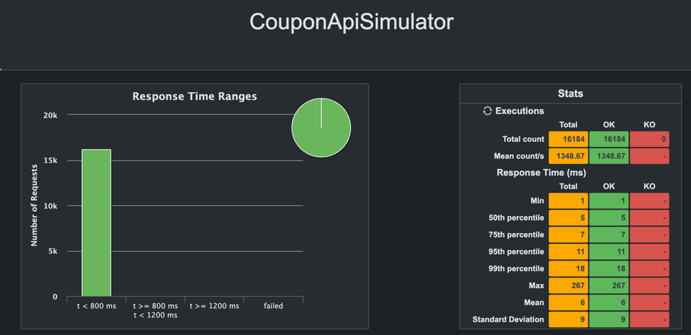
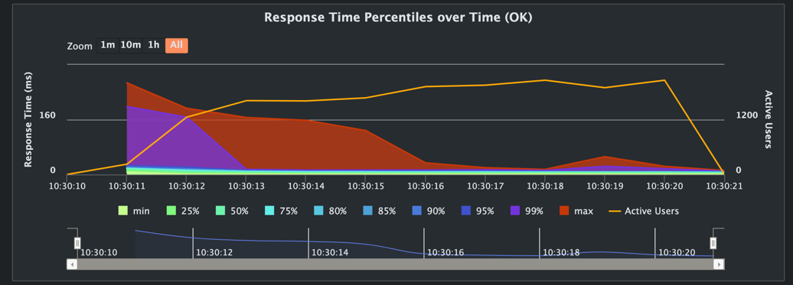
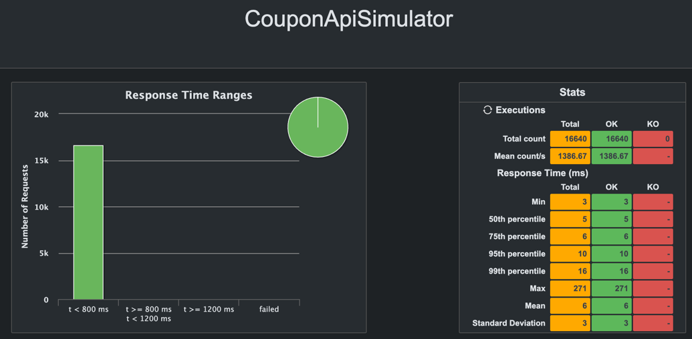

# 📚 traffic-coupon

- 인프런 강의 `김영한의 실전 자바 - 고급 1편, 멀티스레드와 동시성` 을 들으면서 배운것을 응용하기 위해 만든 프로젝트
- 동시에 쿠폰을 발행하면 어떻게 될까?
- **스레드 동기화**, **동시성 처리**

## 🛠️ Tech Stack

### Backend

- JDK 21
- Spring 6.1
- Spring boot 3.3.2
- JPA
- QueryDsl
- Akka

### Database

- h2(test)
- Maria DB(local)

### Test

- Junit
- Gatling

## 📝 도메인

- 쿠폰 생성
    - 쿠폰 생성 시 만료 기한, 발급 개수를 설정할 수 있다.
- 쿠폰 발급
    - 만료 기한 이후에 쿠폰 발급 시 예외가 발생한다.
    - 발급 개수 넘은 다음 부터는 쿠폰 발급 시 예외가 발생한다.
    - 쿠폰을 발급하면 이력이 저장된다.

## ✨ 주요 로직

```java
public interface CouponService {

    Coupon createCoupon(String name, String code, int totalCoupons);

    void issueCoupon(String couponCode, String username);
}
```

- `createCoupon()`: 쿠폰 생성
- `issueCoupon()`: 쿠폰 발급

### 구현체

- `CouponServiceV1`: 멀티 스레드를 고려하지
  않음 [코드](https://github.com/mushroom528/traffic-coupon/blob/main/coupon-application/src/main/java/example/traffic/application/coupon/CouponServiceV1.java)
- `CouponServiceV2`: `synchronized` 키워드를 사용해서
  동기화 [코드](https://github.com/mushroom528/traffic-coupon/blob/main/coupon-application/src/main/java/example/traffic/application/coupon/CouponServiceV2.java)
- `CouponServiceV3`: `ReentrantLock`을 사용해서
  동기화 [코드](https://github.com/mushroom528/traffic-coupon/blob/main/coupon-application/src/main/java/example/traffic/application/coupon/CouponServiceV3.java)
- `CouponServiceV4`: CAS 연산을 통한 `spin lock`을 사용해서
  동기화 [코드](https://github.com/mushroom528/traffic-coupon/blob/main/coupon-application/src/main/java/example/traffic/application/coupon/CouponServiceV4.java)
- `CouponServiceV5`: **Akka**를 통해 메세지 큐 기능을
  사용 [코드](https://github.com/mushroom528/traffic-coupon/blob/main/coupon-application/src/main/java/example/traffic/application/coupon/CouponServiceV5.java)

## 테스트

### 서비스 로직 테스트

- **junit**을 사용한다.

```java

@ActiveProfiles("test")
@ExtendWith(SpringExtension.class)
@ContextConfiguration(classes = {CouponConfig.class})
class CouponServiceTest {

    @Autowired
    CouponService sut;
    @Autowired
    CouponInventoryRepository couponInventoryRepository;
    @Autowired
    CouponHistoryRepository couponHistoryRepository;
    @Autowired
    CouponRepository couponRepository;

    Coupon coupon;

    int couponCount = 30;
    int requestCount = 50;

    @BeforeEach
    void setUp() {
        coupon = sut.createCoupon("테스트쿠폰1", "COUPON-1", couponCount);
    }

    @AfterEach
    void tearDown() {
        couponInventoryRepository.deleteAll();
        couponHistoryRepository.deleteAll();
        couponRepository.deleteAll();
    }

    @Test
    @DisplayName("50명이 신청하는 경우, 30개의 성공이력 20개의 실패이력이 생성된다.")
    void shouldCreate30SuccessAnd20FailureRecordsWhen50ApplicantsApply() {

        // when
        for (int i = 0; i < requestCount; i++) {
            sut.issueCoupon(coupon.getCode(), "USER");
        }
        CouponInventory couponInventory = couponInventoryRepository.findByCouponCode(coupon.getCode()).get();
        List<CouponHistory> histories = couponHistoryRepository.findAll();

        // then
        assertEquals(50, histories.size());
        assertEquals(30, couponInventory.getIssuedCoupons());
        assertHistoryCount(HistoryType.SUCCESS, 30, histories);
        assertHistoryCount(HistoryType.FAIL, 20, histories);
    }

    @Test
    @DisplayName("동시에 50명이 신청하는 경우, 30개의 성공이력 20개의 실패이력이 생성된다.")
    void shouldCreate30SuccessAnd20FailureRecordsWhen50ApplicantsApplyConcurrently() throws InterruptedException {

        // when
        try (ExecutorService executorService = Executors.newFixedThreadPool(32)) {
            CountDownLatch countDownLatch = new CountDownLatch(requestCount);
            for (int i = 0; i < requestCount; i++) {
                executorService.submit(() -> {
                    try {
                        sut.issueCoupon(coupon.getCode(), "USER");
                    } finally {
                        countDownLatch.countDown();
                    }
                });
            }
            countDownLatch.await();
        }

        CouponInventory couponInventory = couponInventoryRepository.findByCouponCode(coupon.getCode()).get();
        List<CouponHistory> histories = couponHistoryRepository.findAll();

        assertEquals(50, histories.size());
        assertEquals(30, couponInventory.getIssuedCoupons());
        assertHistoryCount(HistoryType.SUCCESS, 30, histories);
        assertHistoryCount(HistoryType.FAIL, 20, histories);
    }

    void assertHistoryCount(HistoryType type, int expected, List<CouponHistory> histories) {
        long count = histories.stream().filter(history -> history.getHistoryType() == type).count();
        assertEquals(expected, count);
    }

}
```

- `CouponService`의 구현체를 변경하면서 테스트를 진행한다.
- 구현체 변경은 `CouponConfing`에서 변경한다.
- 동시성을 고려하지 않은 `CouponServiceV1`에서는 아래와 같이 테스트 결과가 나올 것이다.

```shell
Expected :30
Actual   :12
<Click to see difference>

org.opentest4j.AssertionFailedError: expected: <30> but was: <12>
	at org.junit.jupiter.api.AssertionFailureBuilder.build(AssertionFailureBuilder.java:151)
	at org.junit.jupiter.api.AssertionFailureBuilder.buildAndThrow(AssertionFailureBuilder.java:132)
	at org.junit.jupiter.api.AssertEquals.failNotEqual(AssertEquals.java:197)
	at org.junit.jupiter.api.AssertEquals.assertEquals(AssertEquals.java:150)
	at org.junit.jupiter.api.AssertEquals.assertEquals(AssertEquals.java:145)
	at org.junit.jupiter.api.Assertions.assertEquals(Assertions.java:531)
	at example.traffic.application.coupon.CouponServiceTest.shouldCreate30SuccessAnd20FailureRecordsWhen50ApplicantsApplyConcurrently(CouponServiceTest.java:100)
```

- 동시성 이슈가 발생하여 테스트가 실패한다.
- `CouponServiceV1`이 아닌 다른 구현체로 테스트를 진행하면 모든 테스트가 성공한다.
    - 구현체마다 테스트 소요 시간이 다를 것이다.

### API 부하 테스트

- **gatling**을 사용한다.
- 자세한 사용방법은 아래의 링크를 참고하였다.
    - [블로그](https://code-run.tistory.com/42)
    - [gatling 공식문서](https://docs.gatling.io/)
- 처음 사용해보기 때문에 간단하게 샘플을 만들었다.

**샘플 코드**

```java

@RestController
@RequestMapping("/api/gatling")
public class GatlingSampleRestController {

    @GetMapping()
    public String sample() throws InterruptedException {
        TimeUnit.SECONDS.sleep(1);
        return "Hello World";
    }
}
```

- 해당 API는 요청을 받으면 1초동안 대기한다.

```java
public class SampleApiSimulator extends Simulation {
    private static final String BASE_URL = "http://localhost:8080";

    ScenarioBuilder scn = scenario("Gatling Sample Test")
            .exec(http("GET /api/gatling")
                    .get("/api/gatling")
                    .check(status().is(200))
                    .check(bodyString().is("Hello World"))
            );

    {
        setUp(
                scn.injectClosed(constantConcurrentUsers(10).during(10))
        ).protocols(
                http.baseUrl(BASE_URL)
        );
    }
}
```

- 샘플 API에 요청을 보내는 테스트
- `setUp`블록에서 가상의 유저를 설정할 수 있음.
- 10명의 유저가 10초 동안 동시에 요청하는 시나리오
- 테스트 실행: `mvn gatling:test -Dgatling.simulationClass=example.gatling.SampleApiSimulator`
- 실행이 완료 되면 결과를 확인할 수 있도록 리포트가 생성된다.
    - 리포트 위치: target/gatling 하위 디렉토리의 `index.html`
      
    - 요청 횟수 100
    - 모든 요청이 800ms ~ 1200ms 이내에 처리되었음
    - 99%의 요청이 1014ms 이내에 처리되었음

**구현된 코드로 부하 테스트**

```java

@Configuration
@RequiredArgsConstructor
public class CouponConfig {

    private final CouponRepository couponRepository;
    private final CouponInventoryRepository couponInventoryRepository;
    private final CouponHistoryRepository couponHistoryRepository;

    @Bean
    public CouponService couponProxyService() {
        return new CouponServiceV5(couponService());
    }

    @Bean
    @Primary
    public CouponService couponService() {
        return new CouponServiceV2(
                couponRepository,
                couponInventoryRepository,
                couponHistoryRepository
        );
    }
}
```

- `CouponServiceV2`(`synchronized`) 구현체를 사용하여 부하 테스트를 진행한다.

```java
public class CouponApiSimulator extends Simulation {


    ChainBuilder setupRequest = exec(
            http("coupon-setup")
                    .post("")
                    .body(StringBody("{ \"name\": \"기본쿠폰\", \"code\": \"CODE-1\", \"total\": \"50\" }"))
                    .check(status().is(200)) // 상태 코드 200 확인
    );
    ScenarioBuilder setupScenario = scenario("setup").exec(setupRequest);

    ChainBuilder coupon = exec(
            http("Coupon-test")
                    .post("/issue")
                    .body(StringBody("{ \"code\": \"CODE-1\", \"username\": \"hyokwon\" }"))
                    .check(status().is(200)) // 상태 코드 200 확인
    );

    ScenarioBuilder couponScenario = scenario("coupon issue test").exec(coupon);
    HttpProtocolBuilder httpProtocol = http.baseUrl("http://localhost:8080/api/coupon").acceptHeader("application/json").contentTypeHeader("application/json");

    {
        setUp(
                setupScenario.injectOpen(atOnceUsers(1)).protocols(httpProtocol)
                        .andThen(
                                couponScenario.injectClosed(constantConcurrentUsers(10).during(10))
                                        .protocols(httpProtocol)
                        ));
    }
}
```

- 10명의 유저가 10초동안 동시에 요청하는 시나리오
- 쿠폰 생성 API를 먼저 호출 한 뒤에 쿠폰 발행 API 를 동시에 호출
- 쿠폰: 50개 제한

**Detail Report 확인**


- 16,184 개의 요청을 처리
- 모든 요청은 800 ms 이내에 처리됨.



- 응답 시간에 대한 백분위수
- min, 25%, 50%, 75% 등 낮은 백분위수는 바닥에 깔려있어 평균적인 응답 시간이 짧다는 것을 알 수 있음.
- 반면, 99%, max 백분위수는 상대적으로 높게 나타나는데, 이는 일부 요청이 높은 응답 시간을 기록했음을 의미.

## 테스트 진행하는 동안 겪은 문제

### 부하테스트 시 발생한 동시성 이슈

```mariadb
select count(*) as success_count
from coupon_history
where historyType = 'SUCCESS';
```

- 부하 테스트를 진행하고 나서, 해당 쿼리를 통해 성공적으로 발급한 쿠폰의 개수를 확인함 -> 예상되는 개수: 50개


- 하지만 예상되는 결과와 다른 개수가 출력됨

**원인**

- 임계 영역 동기화를 잘 못 설정함
    - 실제로 여러 스레드가 접근하면 안되는 곳은 데이터베이스 영역
    - 따라서 메서드에 `sychronized` 키워드를 선언해도 데이터베이스 조회 시 여러 스레드가 같은 결과를 받아올 수 있음
        - 해당 로직(`couponService.issueCoupon()`)을 수행하고나서 데이터베이스에 `commit` 되기 전에 다른 스레드에서 로직 수행하면서 `commit` 되기 전의 데이터를 조회함
    - 다른 트랜잭션에서 `commit` 한 뒤에 다른 트랜잭션에서 접근 하도록 해야함

**해결 방법**

- Database Lock을 사용한다.
    - 해당 row에 접근 하는 동안 다른 트랙잭션에서 접근할 수 없도록 Lock을 설정한다.
- 메세지 큐를 사용해서 받은 순서대로 순차적으로 처리할 수 있도록 한다.

**테스트 코드에서는 됐던 이유**

- 테스트 코드에서는 `@Transactional`을 선언하지 않고 테스트를 진행했기때문
- 테스트 코드가 역할을 수행하지 못한 상황이 발생했다. -> 테스트는 성공 했지만, 실제 환경에서는 실패해버림..
- 동시성 테스트 시 `@Transactional`을 통한 롤백 기능을 사용할때는 몇 가지 제약사항이 있다. 이는 스프링 공식 문서에도 나타나있음
- [스프링 공식 문서1](https://docs.spring.io/spring-framework/reference/testing/testcontext-framework/parallel-test-execution.html)
- [스프링 공식 문서2](https://docs.spring.io/spring-framework/reference/testing/testcontext-framework/tx.html)

**Database Lock 사용**

```java
public class CouponInventoryRepositoryImpl implements CouponInventoryCustomRepository {

    private final JPAQueryFactory queryFactory;

    @Override
    public Optional<CouponInventory> findByCouponCode(String couponCode) {
        CouponInventory result = queryFactory.selectFrom(couponInventory)
                .innerJoin(couponInventory.coupon, coupon)
                .fetchJoin()
                .where(coupon.code.eq(couponCode))
                .setLockMode(LockModeType.PESSIMISTIC_WRITE)
                .fetchOne();

        return Optional.ofNullable(result);
    }
}
```

- `findByCouponCode`에서 Lock 설정
    - `LockModeType.PESSIMISTIC_WRITE`: 비관적락, 조회 시 데이터베이스에 직접 lock을 설정(Exclusive Lock: `select ~ for update`)
- 결과 확인  
  
- 16,640 개의 요청을 처리함  
  
- 정해진 쿠폰 개수대로 발행됨

**메세지 큐 사용**

- Akka의 Actor 기능을 사용
- Actor 내부에는 MailBox라고 하는 메세지 큐가 있어 받은 메세지를 순차적으로 처리할 수 있음
- 해당 방식도 동일하게 발행한 쿠폰 개수만큼 쿠폰이 발급되는 것을 확인할 수 있었음

## 결론

- 동시성 이슈가 발생 시 어떤 부분에서 동시성 이슈가 발생하는지 파악해야한다.
- 그 부분을 중심으로 해결해 나가야한다.
- Coupon 발급할 때 발생한 동시성 문제의 해결을 위해서는 Database Lock 또는 메세지 큐를 사용하는 방법이 있었다.
    - 위와 같이 JVM 단위의 Lock(`synchronized`, `ReentrantLock`, `CAS Spin Lock`) 을 설정하는 것은 적절한 방법이 아니다.
